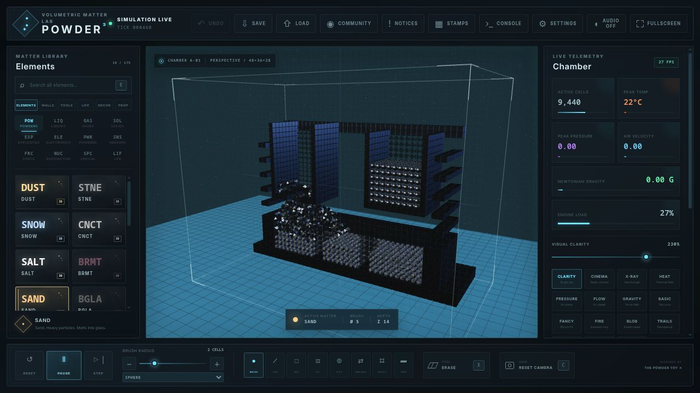

# Powder Toy 3D

[](https://xero00000.github.io/powder-toy-3d/)
[](#validate)
[](docs/PARITY.md)
[](LICENSE)

**A playable, volumetric browser port and remaster of [The Powder Toy](https://github.com/The-Powder-Toy/The-Powder-Toy).** It translates the falling-sand loop into a true 3D cellular chamber with modern WebGL presentation, tactile editing, authored scenarios, and live simulation telemetry.

### [Launch the live build →](https://xero00000.github.io/powder-toy-3d/)



This repository is an original 3D implementation with audited one-to-one feature and element coverage inside its browser-based volumetric scope. All 195 upstream definitions, ordinary-user workflows and simulation surfaces are represented; native host filesystem/process/socket access and staff-only server administration remain deliberate browser security boundaries.

## What is playable

- A `48 × 36 × 28` voxel chamber: 48,384 addressable simulation cells.
- Powders, liquids, gases, and rigid matter moving in all three dimensions.
- The complete 195-definition June 2026 upstream element registry, with all 175 menu-visible elements searchable by original category.
- Dedicated or canonical callback-free 3D behavior paths for all 195 upstream definitions, including independent energy occupancy, actors, electronics, optics, nuclear matter, transport, force, Life and linked SOAP/TRON systems.
- Upstream-derived thermal state machines: pressure-shifted boiling and condensation, typed ice/snow thawing, glass and quartz vitrification, typed lava freezing, and molten ore/alloy/ceramic chemistry.
- Pressure-sensitive FIRE/PLSM/LAVA combustion with canonical lifetimes and products; concentration- and hardness-driven acid/base chemistry; organic growth; and staged volumetric explosions.
- Distinct modern WATR/DSTW/SLTW/CBNW chemistry with salt, metal, erosion, smoke, plant, pressure and propagated bubble behavior; exact O2/H2 flame coupling, pressure-gated combustion, fusion and stellar transmutation.
- Exact VIRS/VRSS/VRSG infection, lifetime and cure propagation with full original-state restoration, SOAP/plasma/proton rules, temperature phases, and decoration-free liquid/solid/emissive-gas rendering.
- Upstream LITH chemistry and battery behavior with insulated charge flow, FIRE-emitting overcharge, state-preserving water/oxygen reactions and lithium-or-glass molten products; field-driven GLOW and spectrum-driven bizarre matter visuals.
- Saturation-accurate GEL, SPNG and MERC physics: paste/base chemistry, sticky volumetric gel forces, exhaustive sponge absorption/release and steam cooling, plus temperature-driven mercury condensation and expansion.
- Pressure-accurate BOYL and refrigerant thermodynamics, including a depth-aware Boyle stencil, Kelvin-scale compression work, raw pressure-history state and reversible RFRG/RFGL phases; RSST/RSSS retain clone-carried fields, canonical reaction products and immediate air blocking.
- Callback-accurate SNOW, NBLE, CO2, YEST and MORT behavior with typed thawing, exhaustive salt contacts, state-resetting reaction products, sampled volumetric creation and the original life-driven plasma colour gradient.
- Exact CAUS GAS/corrosion ordering, two-stage FRZW ice probabilities and exhaustive ANAR cold-flame conversion; generated element metadata now drives ANAR's negative Newtonian mass, while GRAV flares use signed three-axis motion colours.
- Air-deformed GOO, canonical BMTL corrosion/breakage and exhaustive BRMT thermite chemistry; COAL/BCOL use one-shot volumetric FIRE emission, default-state terminal fire and the original remembered-heat glow curve.
- Packed-sample GOLD corrosion reversal, pressure-history QRTZ/PQRT crystal growth and exact tungsten ignition branches, including the correct oxygen threshold, state-preserving FIRE/LAVA products, puff-only recoil and incandescent glow.
- Distinct SHLD1-SHLD4 volumetric growth programs with cooldown-aware spark shells, spontaneous recovery and state-preserving level promotion; carried-state-accurate FOG/RIME deposition and electrification.
- Genomic 3D trees: seeds generate and breed inherited colour/branch programs, obey water and gravity, grow phase-changing thick or thin stems, release descendant seeds, photosynthesize, and render genetically distinct foliage.
- Four authored scenarios: The Foundry, Reactor Breach, Hydro Garden, and Caldera.
- GPU-instanced rendering, ACES tone mapping, thermal lighting, procedural ambience, camera shake, chamber fog, and a cinematic lab interface. The default clarity view uses a bright 230% exposure, high-key lab lighting, stronger hue-preserving dark-material lift and an enabled section cut; bloom remains available in the cinematic and effects views.
- A phone-first responsive workspace with full-screen simulation framing, swipeable controls, bottom-sheet matter and chamber panels, safe-area support, 44-pixel touch targets, and a one-tap Draw/Orbit touch-mode switch.
- Pause, single-step, reset, brush sizing, erase mode, 3D camera orbit, selectable interaction depth, and section-cut inspection.
- Every legacy rendering family in 3D—basic, fancy, fire, blob, persistent, heat, pressure, velocity, gravity, gradient, Life and alternate air—plus clarity, cinematic, X-ray, section cut and adjustable exposure.
- Native `.pt3d` save/load, official OPS1/BSON slice or all-depth atlas export, browser-side `.ops`/`.cps` and legacy PSv/fuC `.stm` import, persistent stamps, dynamic in-world signs, bounded undo/redo history, all 19 walls, all 11 tools, and all 24 built-in Life rules.
- Full upstream decoration blending and property drawing surfaces, including 32-bit particle fields, colour-space-aware smudging, fill/replace workflows, and matter/energy type conversion.
- Wavelength-resolved 3D photon optics with Snell refraction, glass dispersion, total internal reflection, spectral material masks, broken-glass scatter, quartz diffusion, and all 12 filter modes.
- Upstream-timed 3D electronics with exact carrier recovery and material callbacks, synchronized/red-BRAY switches, binomial EMP damage, midpoint INSL/RSSS blocking, temperature/pressure-gated quartz conduction, insulated sensors, delays and life-timed electrode arcs, plus one-frame temperature-channelled WIFI signaling.
- Powered 3D LCRY/PUMP/GPMP/HSWC networks with original charge/fade and activation countdowns, pressure and Newtonian-gravity field coupling, heat-switch gating, and FILT data-driven setpoints.
- Full volumetric ARAY/BRAY, CRAY and DRAY control semantics: diagonal beams, FILT colour, red erase, INST pass-through, configurable count/gaps, packed-Life markers, complete matter/energy state copying and remapped SOAP topology.
- Upstream-derived 3D CLNE/BCLN/PCLN/PBCN and CONV behavior, including powered photon/Life bursts, pressure-fracture countdowns, restricted conversion, energy priority and packed Life-rule ctypes.
- Filterable VOID/PVOD networks and distinct vacuum/vent versus Newtonian black/white holes, with 3D activation propagation, matter/energy absorption, anti-air cooling, heat transfer, and property-scaled gravity.
- Exact sparse and zero-padded FFT-accelerated dense 3D Newtonian gravity, sharing upstream's `0.6673` inverse-square law and sealed gravity-wall masking.
- Upstream-style PSTN/FRME machinery with extension arm limits, obstacle and too-short policies from all four `tmp3` flags, shortened travel, and atomic 3D sticky-frame branch rollback.
- Upstream-derived destructive and force specials: lifecycle-driven SING vacuum, merging and mass-scaled energy pops; four-contact AMTR annihilation and photon conversion; programmable face-neighbor ACEL/DCEL; sampled typed RPEL; inclusive multi-spark FRAY; distributed DMG fracture waves; and two-phase GBMB gravity.
- Six distinct 3D sensor state machines with delayed insulated outputs, high/low threshold modes, FILT serialization/deserialization, wavelength copying, and flag-controlled LDTC directional scans.
- Branching volumetric lightning with brush-sized power, 3D Tesla launch direction, staged bolt decay, conductor/nuclear reactions, and pressure/ambient-heat coupling.
- Colour-routed 3D PIPE/PPIP networks with visible route phases, matter/energy transport, powered pause/reverse floods, HEAC conduction, and decoration-safe payload transfer.
- A persistent sandboxed Lua 5.3 console with `sim`, `tpt`, mutable `elements`/`elem`, `ren`, `ui`/`interface`, `event`/`evt` and bounded `fs`/`fileSystem` compatibility surfaces; real runtime custom particles; upstream-shaped update and graphics callbacks; script-created windows and controls; 3D particle/field access; scripted particle, wall, tool and decoration drawing; tick/UI callbacks; coalesced undo checkpoints; a hard instruction budget; and a built-in local script editor/library with import, export, `loadfile`/`dofile` and explicit autorun.
- An integrated official-community browser with search, sort, period filters, pagination, live thumbnails, save metadata, tags, comments and public profiles; official MotD, notification, session and build metadata; guest download/import; session-only account login; authenticated vote, favourite, comment, report, tag and owner-profile actions; and validated private-by-default OPS publishing through a fixed same-origin gateway.

## Quick start

Node.js 20 or newer is recommended.

```bash
pnpm install
./run.sh
```

Open `http://127.0.0.1:5173`. You can also use `pnpm dev`, `pnpm build`, and `pnpm preview` directly.

The GitHub Pages build contains the complete client-side sandbox plus a live, read-only view of the official Powder Toy community: browse, search, previews, save details, tags, comments, profiles, MotD and release metadata all come from `powdertoy.co.uk`. The static host never sends credentials through a third party; account actions and direct in-app CPS import remain available only through the allowlisted same-origin gateway in `scripts/community-proxy.mjs` when running locally. On Pages, the save action opens the official CPS download instead.

## Controls

| Input | Action |
| --- | --- |
| Left mouse | Paint the selected material on the current interaction plane |
| Right mouse drag | Orbit the 3D camera |
| Middle mouse / Alt+wheel | Dolly the camera |
| Touchscreen | Tap or drag to paint; use **Touch Draw/Orbit** to switch to one-finger orbit and two-finger zoom/pan |
| Mobile **Matter** / **Lab** | Open the bottom-sheet element library or chamber controls |
| Wheel | Change brush radius |
| `Space` | Pause or resume |
| `F` | Advance one simulation tick |
| `R` | Reset the active scenario |
| `X` | Toggle eraser |
| `S` | Toggle section cut |
| `C` | Reset camera |
| `[` / `]` | Change brush radius |
| `1`–`5` | Switch material category |
| `Ctrl+S` / `Ctrl+O` | Export `.pt3d`, or import `.pt3d`, `.ops`, `.cps` and `.stm` saves/stamps |
| `Ctrl+Z` / `Ctrl+Y` | Undo or redo |

The depth slider moves both the paint plane and section boundary. With Section Cut enabled, cells in front of that plane are hidden so internal machinery and reactions remain editable.

## Architecture

- `src/simulation.js` contains the typed-array voxel engine and authored scenarios. It has no renderer dependency and is covered by headless tests.
- `src/ops-import.js` validates OPS1 containers, decompresses BSON and projects legacy 2D saves into layered 3D without flattening matter/energy overlaps.
- `src/ops-export.js` writes official OPS1/BSON saves from the current interaction-depth slice or a tiled all-depth atlas, including particle state, walls, fans, fields, signs and simulation settings.
- `src/psv-import.js` decodes the historical PSv/fuC stamp format, including its field planes and version-specific element migrations.
- `src/community-client.js` validates and normalizes official browse, detail, profile, account-action and upload responses. It automatically selects a live public read transport on GitHub Pages, while `scripts/community-proxy.mjs` supplies the tightly whitelisted same-origin gateway used for direct save import and session-bound account actions locally.
- `src/renderer.js` maps simulation state into nine physically differentiated instanced material streams plus independent energy, wall, field, trail, actor, SOAP-link and sign passes, then adds camera, chamber, lighting, and post-processing.
- `src/main.js` owns the fixed-step loop, interaction model, UI state, telemetry, and controls.
- `src/materials.js` is the material registry and the natural expansion point for additional elements.
- `src/property-tool.js`, `src/signs.js`, `src/console.js`, `src/lua-console.js`, `src/lua-filesystem.js`, and `src/lua-script-library.js` provide the upstream-style property editor, dynamic sign formatting, safe command surface, lazily loaded stateful Lua runtime, mutable script controls/elements, persistent virtual script storage, and the local script-manager model.
- `src/upstream-elements.generated.js` is an auditable registry generated from the upstream C++ element definitions; `scripts/sync-upstream-elements.mjs` refreshes it against a chosen checkout.
- `src/soundscape.js` generates a small reactive sound bed with the Web Audio API; no audio files are required.

The simulation runs at a fixed 24 Hz while rendering is independent and display-paced. A capped accumulator prevents a slow frame from triggering an unrecoverable update spiral.

## Validate

```bash
pnpm test
pnpm build
pnpm benchmark
pnpm audit:saves
pnpm audit:parity
```

The 18 headless test files cover registry parity, every selectable element, element families, 3D optics, energy, actors, Life, tools, walls, decoration/property editing, Lua scripting and script-library persistence, native saves, OPS/BSON import and export, PSv decoding, community protocol fixtures, gravity, phase changes, volumetric painting and scenario integrity. The benchmark measures 120 simulation steps across all four scenarios at the default `48 × 36 × 28` size and enforces the 24 Hz p95 budget. `audit:saves` downloads a SHA-256-pinned ten-save public OPS/PSv/fuC corpus into the system temporary directory and verifies OPS versions 92/100 plus legacy versions 27/41/44/61, particle accounting, lossless fits and capacity-limited imports. `audit:parity` fails closed on registry drift, non-ported routes or a selectable element no longer named by the behavior corpus. The production build is fully bundled and does not depend on a CDN at runtime.

## Upstream relationship and license

The original Powder Toy is a C++/SDL project by The Powder Toy contributors and is distributed under GPL-3.0. This independent 3D adaptation is also released under `GPL-3.0-or-later`; see `LICENSE`. The interface prominently links back to the upstream repository.

The complete subsystem and per-element completion criteria live in `docs/PARITY.md`. Menu presence is intentionally not treated as behavioral parity.
